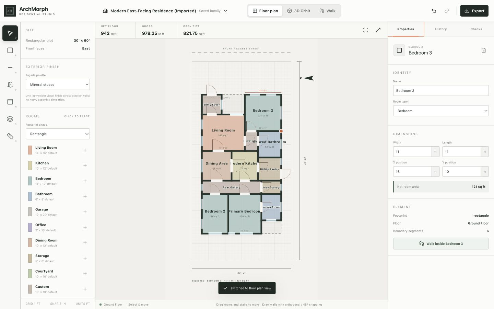
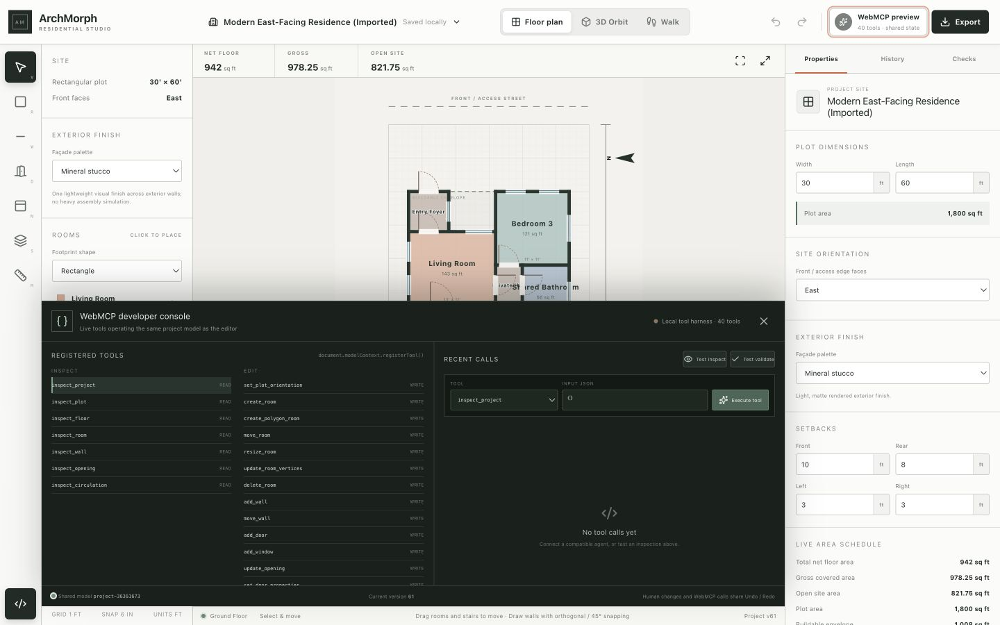

# ArchMorph

**A human + agent architecture studio for the open web.**

ArchMorph is a browser-based architectural concept-design environment where a person and a WebMCP agent work on the same live building model. People draw and inspect spatial ideas visually; agents use named, typed tools to inspect, edit, measure, validate, navigate, and present that exact design.

- **Live application:** [archmorph-studio.musfk.chatgpt.site](https://archmorph-studio.musfk.chatgpt.site)
- **WebMCP Challenge:** [webmcp.devpost.com](https://webmcp.devpost.com/)
- **Detailed product and engineering reference:** [docs/ARCHMORPH_RESEARCH_AND_ROADMAP.md](docs/ARCHMORPH_RESEARCH_AND_ROADMAP.md)



## Why WebMCP

Coordinate clicking is fragile in an architectural editor. A small visual error can select the wrong wall, place an opening outside its host, or edit the wrong floor. ArchMorph instead exposes 51 architectural operations through `document.modelContext.registerTool()`.

The agent works with stable floor, room, wall, opening, and stair identifiers. Human actions and WebMCP calls both pass through the same operation pipeline, so they share:

- one canonical project model;
- topology reconstruction and architectural validation;
- undo/redo, activity history, versioning, and local persistence; and
- synchronized SVG plan and Three.js model views.

A representative collaboration loop is:

1. The agent calls `inspect_project`, `inspect_floor`, and `inspect_circulation`.
2. The person describes a spatial goal.
3. The agent edits the design with stable IDs and real dimensions.
4. ArchMorph returns the changed elements and validation evidence.
5. The person adjusts the result directly in the plan.
6. The agent re-inspects the shared state, refines it, and presents it in 3D or Walk Mode.

## Current capabilities

- Per-project editable land size, cardinal orientation, setbacks, buildable envelope, coverage, and open-area metrics.
- Multiple floors with explicit elevations and storey heights.
- Rectangular, L-, T-, U-, and custom orthogonal polygon rooms.
- Canonical walls with connectivity, adjacency, and exterior/interior classification.
- Hosted doors and windows with handing, operation, and glazing-performance properties.
- Connected straight stairs with four plan rotations, slab openings, and Walk Mode transitions.
- Exact dimensions, direct manipulation, snapping, selection, and measurement.
- Circulation graphs with entrance-to-room route evidence.
- Validation for overlap, plot/setback violations, opening hosts, circulation, and stairs.
- Local project library, JSON import/export, SVG export, migration, and undo/redo.
- Synchronized SVG plan, Three.js orbit view, and first-person Walk Mode.
- Flat roofs with adjustable parapets; balcony/terrace slabs with bounded railing styles; and boundary walls with adjustable gates.
- Project façade palettes, per-exterior-wall finish overrides, and wall-hosted frames, canopies, and sunshades.
- Exterior finish presets and conceptual SHGC, VT, and U-factor glazing values.

ArchMorph intentionally focuses on architecture rather than furniture, decoration, cinematic effects, or unvalidated simulation.

## WebMCP tool surface

| Category | Count | Examples |
| --- | ---: | --- |
| Inspect | 8 | `inspect_project`, `inspect_floor`, `inspect_exterior`, `inspect_circulation` |
| Edit | 32 | `configure_plot`, `add_balcony`, `set_roof`, `configure_site_boundary`, `add_facade_feature` |
| Calculate and validate | 5 | `calculate_room_area`, `measure_distance`, `validate_layout` |
| Present | 6 | `switch_view`, `set_camera`, `focus_element`, `take_snapshot`, `export_plan` |

The full definitions live in [`src/lib/webmcp-tools.ts`](src/lib/webmcp-tools.ts). Repeatable journeys and the native-client smoke procedure are recorded in [`evals/webmcp-journeys.json`](evals/webmcp-journeys.json) and [`docs/WEBMCP_TESTING.md`](docs/WEBMCP_TESTING.md).



## Run locally

### Requirements

- Node.js 22 or newer
- npm

### Setup

```bash
git clone https://github.com/Yousafkhanzadaa/ArchMorph.git
cd ArchMorph
npm ci
npm run dev
```

Open the local URL printed by the development server, normally [http://localhost:3000](http://localhost:3000).

To load the included sample residence, open the project menu, select **Import**, and choose [`fixtures/recovered-modern-house.archmorph.json`](fixtures/recovered-modern-house.archmorph.json).

Add `?debug=1` to the local URL only when you need the WebMCP catalog and local tool harness. The normal production interface deliberately keeps engineering controls hidden.

## Verification

```bash
npm run test:architecture
npm run test:webmcp
npm run lint
npm run build
```

`test:architecture` covers canonical geometry, topology, openings, circulation, stairs, polygonal rooms, exterior systems, per-project sites, persistence, migrations, and spatial collision data. `test:webmcp` checks the 51-tool catalog, schema boundaries, annotations, unique names, and representative inspection/mutation failures.

The N01–N10 production baseline was verified with ChatGPT desktop 26.825.41651 (build 7345) when the deployed catalog contained 40 tools: N01–N07 and N09–N10 passed, and N08 was N/A because that client exposes no cancellation mechanism. The current 51-tool catalog additionally passed native local discovery and representative exterior-system execution on August 30. See [`docs/WEBMCP_TESTING.md`](docs/WEBMCP_TESTING.md) for the exact records.

The under-three-minute recording plan and narration are ready in [`docs/DEMO_VIDEO_SCRIPT.md`](docs/DEMO_VIDEO_SCRIPT.md).

## Architecture

| Area | Responsibility |
| --- | --- |
| [`src/lib/architecture.ts`](src/lib/architecture.ts) | Canonical schema, operations, topology, metrics, circulation, inspection, and validation |
| [`src/app/components/Studio.tsx`](src/app/components/Studio.tsx) | Product shell, shared commit/history path, persistence, and WebMCP registration |
| [`src/app/components/FloorPlan.tsx`](src/app/components/FloorPlan.tsx) | Editable SVG plan, selection, dimensions, and snapping |
| [`src/lib/spatial3d.ts`](src/lib/spatial3d.ts) | Derived wall/opening and collision geometry |
| [`src/app/components/ModelView.tsx`](src/app/components/ModelView.tsx) | Three.js model, orbit navigation, and Walk Mode |
| [`src/lib/persistence.ts`](src/lib/persistence.ts) | Local project library, import/export, and schema migration |
| [`src/lib/webmcp-tools.ts`](src/lib/webmcp-tools.ts) | Typed WebMCP tool catalog |

The project uses Next.js 16, React 19, TypeScript, Three.js, SVG, Tailwind CSS, vinext, Vite, and Cloudflare/OpenAI Sites integration.

## Scope and limitations

ArchMorph is a concept and schematic-design tool. Its calculations and checks do not constitute BIM authoring, construction documentation, building-code approval, structural engineering, energy certification, permit review, or professional architectural services.

- Canonical project units are currently feet.
- Persistence is local to the browser; there is no multi-user server project library yet.
- Stair and circulation findings are early-design guidance with stated assumptions.
- Glazing presets are conceptual rather than certified product data.
- WebMCP is an emerging specification, so browser support and API details may change.

## Competition record

ArchMorph was created during The WebMCP Challenge submission period. The timestamped implementation record and evidence paths are in [`docs/COMPETITION_EVIDENCE.md`](docs/COMPETITION_EVIDENCE.md).

## License

Released under the [MIT License](LICENSE).
