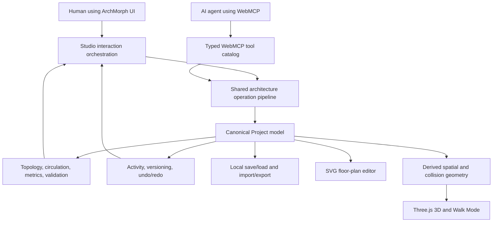

# ArchMorph: Product, Architecture, WebMCP, and Hackathon Reference

**Status:** Living product and engineering reference

**Research snapshot:** August 27, 2026

**Product scope:** Architectural design only; not interior decoration

**Competition:** [The WebMCP Challenge](https://webmcp.devpost.com/)

This document records the research basis, current implementation, product boundaries, competition strategy, known gaps, and future roadmap for ArchMorph. It is intended to keep product, architectural, and engineering decisions aligned as the project evolves.

Time-sensitive facts—especially WebMCP browser support and Devpost dates—must be rechecked against the linked official pages before submission. For the competition, the [Devpost website and official rules](https://webmcp.devpost.com/rules) are authoritative if this document ever differs from them.

## 1. Executive summary

ArchMorph is a browser-based architectural concept-design environment where a person and an AI agent work on the same live building model. A person can draw and inspect a design visually; an agent can inspect, edit, measure, validate, navigate, and present that same design through WebMCP tools. Both paths use the same project state and operation pipeline.

The product is deliberately architecture-first. It should help users reason about plots, levels, rooms, walls, openings, circulation, stairs, measurements, building form, envelope performance, and environmental response. It should not become a furniture arranger, decoration catalog, or cinematic 3D toy.

ArchMorph is a strong fit for the WebMCP Challenge because spatial design is difficult to express through isolated chat messages and unreliable coordinate clicking. WebMCP gives the agent named, typed, state-aware operations while keeping the human in the visual workspace. The most compelling demonstration is not “AI generates a floor plan”; it is a visible collaboration loop:

1. The agent inspects the current project and constraints.
2. The human describes an architectural goal.
3. The agent makes a sequence of precise edits using stable element identifiers.
4. ArchMorph validates the result and shows the same changes in plan and 3D.
5. The human adjusts the design directly.
6. The agent re-inspects, explains tradeoffs, and refines the live model.

The current product contains a meaningful architectural domain model, 2D and 3D synchronization, browser persistence, Walk Mode, multi-storey stairs, orthogonal irregular rooms, editable project sites, lightweight exterior systems, glazing properties, validation, and 51 WebMCP tools.

## 2. Product purpose and boundaries

### 2.1 Purpose

ArchMorph exists to make early architectural design understandable and directly manipulable by both people and AI agents. It targets the concept and schematic-design stage, where users need rapid spatial exploration but still benefit from explicit dimensions, topology, circulation, and defensible environmental inputs.

The product should help answer questions such as:

- Does the proposed program fit within the buildable plot envelope?
- Are rooms connected by plausible circulation paths?
- Do doors, windows, and stairs belong to valid hosts and levels?
- Can a person understand the building both as a plan and by walking through it?
- How do orientation, glazing, shading, and envelope choices affect the design concept?
- Which design change produced a validation issue, and what evidence supports it?
- Can an agent make a precise revision without guessing screen coordinates or corrupting the model?

### 2.2 Intended users

- Architects and architectural designers during early studies.
- Architecture students learning spatial planning and circulation.
- Clients participating in a guided concept-design conversation.
- Developers or planners exploring preliminary feasibility.
- AI agents assisting a human inside a live, visible design session.

ArchMorph is not presently a replacement for BIM authoring, construction documentation, structural engineering, code review, energy certification, or professional architectural services.

### 2.3 Architecture-first boundary

In scope:

- Plot, orientation, setbacks, and buildable envelope.
- Floors, elevations, storey heights, and vertical circulation.
- Spaces/rooms, walls, openings, adjacency, and circulation.
- Exact dimensions, snapping, selection, and transformations.
- Common architectural form and roof geometry.
- Exterior envelope materials and meaningful performance properties.
- Daylight, solar, glazing, and shading concepts based on explicit inputs.
- 2D plans, 3D understanding, Walk Mode, sections, and elevations.
- Architectural validation, schedules, and interoperable export.

Out of scope or deliberately low priority:

- Furniture placement and furniture catalogs.
- Fabrics, decor, artwork, ornaments, styling, and mood-board workflows.
- Fine-grained interior finish selection whose main value is decorative.
- Decorative or unusual primitives without a recurring architectural use.
- Cinematic effects, excessive camera filters, and nonessential animations.
- Door-animation polish beyond what is useful for circulation or clearance.
- Visually impressive but physically misleading solar, daylight, or energy effects.

Room colors remain in scope because they support zoning, room identity, plan legibility, and spatial communication.

## 3. Why WebMCP is the right interaction layer

Conventional browser agents often have to infer meaning from pixels and operate controls indirectly. That is fragile in a drawing application: a small coordinate error can select the wrong wall, place an opening off its host, or make an edit at the wrong level. WebMCP lets a page expose named JavaScript tools with JSON Schema inputs, so an agent can interact with the application’s domain concepts rather than guessing UI gestures. This is the progressive-enhancement model described by the [Chrome WebMCP documentation](https://developer.chrome.com/docs/ai/webmcp).

ArchMorph benefits in four ways:

1. **Precision.** The agent uses stable floor, room, wall, opening, and stair identifiers plus real dimensions.
2. **Shared context.** Human and agent operate the same open page, authenticated session, project state, selection, and view.
3. **Verifiability.** Inspection and validation tools return structured evidence, while the UI visibly reflects mutations.
4. **Composability.** The agent can inspect, edit, validate, focus, switch view, and capture a result as a coherent workflow.

This shared-workspace model is the key difference between useful collaboration and a detached chatbot that merely suggests dimensions.

## 4. Current ArchMorph software architecture

### 4.1 Technology stack

- Next.js 16.3.3 and React 19.2.8.
- TypeScript.
- Three.js 0.185.1 for 3D visualization and Walk Mode.
- SVG-based 2D plan editing.
- Browser-local persistence with schema migration.
- Vite/vinext and Cloudflare/OpenAI Sites deployment integration.
- Native WebMCP registration through `document.modelContext.registerTool()` when supported.

### 4.2 System shape



The central principle is one canonical project model and one mutation pipeline. WebMCP tools do not maintain a parallel “AI model” of the project. Human actions and tool calls produce the same operation types, validation behavior, activity history, version changes, persistence updates, and derived 2D/3D views.

### 4.3 Main implementation responsibilities

| Area | Current responsibility |
| --- | --- |
| `src/lib/architecture.ts` | Canonical types, architectural operations, topology, circulation, measurements, inspection, metrics, and validation |
| `src/app/components/Studio.tsx` | Product shell, interaction orchestration, shared commit/history path, WebMCP registration, production UI, and debug-mode boundary |
| `src/app/components/FloorPlan.tsx` | SVG plan rendering, direct manipulation, selection, measurements, and snapping |
| `src/lib/spatial3d.ts` | Derived wall/opening geometry and collision data used by 3D navigation |
| `src/app/components/ModelView.tsx` | Three.js model, camera/navigation modes, level presentation, openings, stairs, and Walk Mode |
| `src/lib/persistence.ts` | Local project library, save/load, import/export, and schema migration |
| `src/lib/webmcp-tools.ts` | 51 typed tools mapped to inspections, operations, calculations, validation, and presentation actions |
| `src/types/webmcp.d.ts` | Local types for the current WebMCP imperative API |
| `scripts/architecture-regression.ts` | Deterministic architectural-domain regression coverage |

### 4.4 Canonical model

The project schema currently contains:

- Plot dimensions, orientation, and four setbacks.
- Floors with stable IDs, level numbers, elevations, and heights.
- Rectangular, L-, T-, U-, and custom orthogonal polygon rooms with stable IDs, floor ownership, ordered vertices, derived bounds, color, and boundary-wall references.
- Canonical walls with endpoints, thickness, height, adjacent room sides, exterior status, and connectivity.
- Hosted doors and windows with offsets, dimensions, configuration, and glazing properties.
- Straight stairs with source floor, position, direction, width, length, four 90-degree rotations, and derived connection geometry.
- A project-wide lightweight exterior finish preset used by the 3D facade.
- Current view/navigation state.
- Activity entries, project version, and update time.

Stable IDs are important: visual selection, WebMCP, inspection, validation, persistence, and export can refer to the same element without relying on labels or screen positions.

### 4.5 Current interaction and consistency contract

Every mutation should follow this contract:

1. Parse and validate the requested operation.
2. Resolve referenced stable IDs against the live project.
3. Apply the smallest domain mutation.
4. Rebuild or reconcile dependent topology.
5. Run relevant validation and return evidence.
6. Record activity/version information and make the change undoable.
7. Persist the new state.
8. Derive both 2D and 3D representations from the same result.

Future work should preserve this contract. Geometry should not be added directly inside a renderer if it cannot also be selected, edited, measured, validated, saved, exported, and operated on through the shared model.

## 5. Current architectural capability inventory

### 5.1 Site and building organization

- Configurable plot width and length.
- Front, rear, left, and right setbacks with a derived buildable envelope.
- Cardinal front-edge orientation and a visible north arrow.
- Multiple floors with elevations and heights.
- Coverage, floor area, open area, and room-area calculations.

### 5.2 Spaces, walls, and openings

- Create, move, resize, select, inspect, vertex-edit, and delete rectangular or orthogonal polygon rooms.
- L-, T-, and U-shaped human placement presets plus custom 4–12 vertex room creation/editing through WebMCP.
- Canonical room-boundary walls and independent walls.
- Wall movement, thickness/height data, adjacency, connection data, and exterior/interior classification.
- Hosted doors and windows with wall-relative offsets.
- Door width, height, swing/handing/hinge properties, open/closed state, and rehosting.
- Window size, sill, type, operability, glazing preset, performance properties, and rehosting.
- Opening-overlap, host, adjacency, and boundary validation.

### 5.3 Circulation and multi-storey navigation

- Room-to-room and room-to-exterior circulation graph derived from doors, including explicit main-entrance-to-room paths and element evidence.
- Straight stairs connected between adjacent levels.
- Four plan rotations at 0°, 90°, 180°, and 270° shared by plan, 3D, slab voids, collision, and Walk Mode.
- Derived rise, riser count, riser height, tread count, tread depth, and recommended run.
- Stairwell voids in upper floor slabs.
- Floor-to-floor movement in Walk Mode.
- Validation for invalid stair connections and concept-level stair geometry.

The stair checks are design guidance, not a building-code approval. The current thresholds use residential concepts comparable to the [2021 International Residential Code stair provisions](https://codes.iccsafe.org/content/IRC2021P1/chapter-3-building-planning), but the applicable jurisdiction, occupancy, accessibility rules, and adopted code always govern.

### 5.4 2D, 3D, and navigation

- Editable SVG floor plan.
- Selection, transform interactions, exact dimensions, measurement, and snapping.
- Orthogonal snapping plus 45-degree guidance for independent walls.
- Synchronized Three.js building view.
- Orbit and Walk navigation.
- Camera presets, element focus, and snapshots.
- Debug/diagnostic controls available only through explicit debug mode (`?debug=1` or `?mode=debug`).

### 5.5 Environmental properties

Windows include visible transmittance (VT), solar heat gain coefficient (SHGC), and U-factor presets for clear, low-e, and privacy glazing. These are more defensible than an arbitrary “glass brightness” slider:

- U-factor describes heat transfer through the whole window assembly; lower is generally more insulating.
- SHGC describes the fraction of incident solar heat admitted; lower reduces solar heat gain.
- VT describes the fraction of visible light transmitted; higher usually admits more daylight.

The definitions and climate/orientation importance align with the [U.S. Department of Energy’s window guidance](https://www.energy.gov/energysaver/window-types-and-technologies) and [Federal Energy Management Program guidance](https://www.energy.gov/cmei/femp/purchasing-energy-efficient-residential-windows-doors-and-skylights). Current values are conceptual presets, not certified product values; real product selection should use ratings such as those maintained by the [National Fenestration Rating Council](https://nfrc.org/).

### 5.6 Validation

Current validation can identify:

- Room overlap.
- Elements outside the plot.
- Setback violations.
- Invalid or overlapping openings.
- Rooms with no access or no exterior access.
- Disconnected circulation.
- Invalid stair connection or geometry.
- Openings lacking valid adjacency.
- Walls outside the plot.

Issues include stable IDs, severity, human-readable messages, evidence, and suggested correction context. This evidence-oriented shape is valuable to both human users and agents.

## 6. WebMCP research and implementation guidance

### 6.1 Standard status

The [WebMCP specification](https://webmachinelearning.github.io/webmcp/) is currently a Draft Community Group Report from the W3C Web Machine Learning Community Group. It is not a W3C Standard or a W3C Standards Track document. ArchMorph should therefore isolate browser API integration behind a small adapter and expect signatures or annotations to evolve.

WebMCP allows a web page to expose JavaScript-based tools to an AI client. Its central browser object is `document.modelContext`. The imperative API registers programmatic tools; the declarative API associates tools with forms and existing document interactions.

### 6.2 Imperative API model used by ArchMorph

ArchMorph uses the imperative form:

```text
document.modelContext.registerTool(toolDefinition, { signal })
```

A tool definition contains:

- `name`: stable machine identifier.
- `title` where supported: human-readable label.
- `description`: when and why the agent should use it.
- `inputSchema`: JSON Schema describing accepted arguments.
- `execute(input, options)`: implementation, with an abort signal available in the execution options.
- `annotations`: supported behavioral hints such as `readOnlyHint` and `untrustedContentHint`.

The registration signal controls the tool’s lifetime. Aborting it unregisters the tool, which is why ArchMorph creates an `AbortController` when registering and aborts it during component cleanup. Tool names should remain within the specification’s 1–128-character limit and use ASCII letters, digits, underscores, hyphens, or periods.

### 6.3 Page-scoped tools versus an MCP server

[OpenAI’s Site Tools documentation](https://learn.chatgpt.com/docs/webmcp) describes Site Tools as its implementation of the proposed WebMCP standard.

| WebMCP / Site Tools | MCP server |
| --- | --- |
| Discovered from the page currently open in a compatible browser | Connected independently of whether a page is open |
| Shares the live page and signed-in browser session | Usually maintains a remote or local service connection |
| Excellent for UI-linked, human-in-the-loop workflows | Excellent for service, data, and background workflows |
| Tool availability can end when the page navigates or closes | Tool availability follows the server connection |
| Reuses page-side permissions and business logic | Requires server-side authentication and authorization design |

These approaches are complementary. ArchMorph should keep WebMCP as the primary live-design interaction and may later add an MCP server for project libraries, batch analysis, or collaboration that does not require an open editor.

### 6.4 Progressive enhancement and fallback

WebMCP must not be the only way to operate ArchMorph. The normal human interface remains complete and usable. When `document.modelContext` is unavailable, the app continues to function and the production UI does not expose engineering clutter. The local tool harness is deliberately confined to debug mode.

This follows the progressive-enhancement approach in the [Chrome WebMCP overview](https://developer.chrome.com/docs/ai/webmcp): structured tools improve agent reliability without replacing the website.

### 6.5 Security and trust boundaries

The WebMCP specification and [Chrome’s secure-tools guidance](https://developer.chrome.com/docs/ai/webmcp/secure-tools) treat tool definitions, parameters, and results as security-sensitive. ArchMorph should follow these rules:

- Reuse the same authorization, validation, and business logic as human actions.
- Keep each schema narrow: explicit types, enums, ranges, required fields, `additionalProperties: false`, and practical string limits.
- Never treat a model-selected tool call as authorization for unrelated effects.
- Make side effects clear in tool names and descriptions.
- Use `readOnlyHint: true` only for operations guaranteed not to mutate state.
- Use `untrustedContentHint: true` when a result can include imported, shared, or otherwise untrusted user content.
- Return enough structured state for the agent to verify the result, but do not expose secrets or unrelated project data.
- Default to same-origin exposure. Only use `exposedTo` for explicitly trusted origins with a reviewed need.
- Preserve origin isolation and the WebMCP `tools` Permissions Policy.
- Handle cancellation through the execution signal for long-running exports or analysis.
- Require explicit human confirmation before any future destructive, external, paid, publishing, or sharing action.

ArchMorph currently marks read-only inspections and calculations appropriately. Because imported project names and labels can eventually contain untrusted text, output classification should be reviewed before shared/imported projects are a submission feature.

Chrome’s current guidance also recommends concise definitions to stay within agent context budgets—roughly 500 characters for a tool description, 150 for a parameter description, 30 for names, and about 1,500 characters for outputs. These figures are implementation guidance and may change, not standard limits.

### 6.6 Tool design rules for ArchMorph

Every tool should:

1. Represent an architectural intent, not a UI click.
2. Use stable identifiers returned by inspection tools.
3. Accept only the information required for that intent.
4. Reuse the shared architecture operation pipeline.
5. Return the changed element, relevant metrics, validation consequences, and the new project version when appropriate.
6. Fail with a specific, actionable message rather than silently approximating.
7. Avoid hidden cascades; if multiple edits are required, make the sequence inspectable.
8. Leave the visible UI synchronized so the human can understand and correct the result.

Good: `rehost_window({ openingId, wallId, offset })`.

Weak: `click_canvas({ x, y })`.

### 6.7 Current 51-tool surface

| Category | Count | Tools |
| --- | ---: | --- |
| Inspect | 8 | `inspect_project`, `inspect_plot`, `inspect_exterior`, `inspect_floor`, `inspect_room`, `inspect_wall`, `inspect_opening`, `inspect_circulation` |
| Edit | 32 | Existing room/wall/opening/stair/floor tools plus `configure_plot`, `set_wall_finish`, `set_roof`, `configure_site_boundary`, balcony CRUD, and façade-feature CRUD |
| Calculate/validate | 5 | `calculate_room_area`, `calculate_total_area`, `calculate_open_area`, `measure_distance`, `validate_layout` |
| Present | 6 | `switch_view`, `set_camera`, `set_navigation_mode`, `focus_element`, `take_snapshot`, `export_plan` |

The breadth is useful, but tool count is not itself a competition advantage. The submission should demonstrate a small number of coherent, high-value journeys and prove that the agent chooses and sequences tools correctly.

### 6.8 WebMCP evaluation strategy

The [Chrome WebMCP evaluation guidance](https://developer.chrome.com/docs/ai/webmcp/evals) recommends testing tool selection and end-to-end journeys in addition to deterministic application tests. ArchMorph needs both:

| Evaluation layer | Example |
| --- | --- |
| Purpose | “What tool inspects whether all rooms are reachable?” selects `inspect_circulation` |
| Selection | An area question selects `calculate_room_area`, not an edit tool |
| Arguments | “Make Bedroom 2 twelve feet wide” resolves the correct room ID and dimension |
| Sequence | Inspect project → inspect floor → edit → validate → focus result |
| Result quality | Mutation returns stable IDs, dimensions, version, and relevant findings |
| Full journey | Add a second floor and connected stair, switch to 3D Walk Mode, ascend, validate, and capture a snapshot |
| Failure behavior | Invalid host wall or overlapping opening produces a clear, non-destructive error |
| Cancellation | Long-running capture/export responds safely to abort |

Deterministic unit/regression tests must remain the authority for domain operations. Model-based evaluations test whether an agent understands how to use those operations; they do not replace geometry and validation tests.

### 6.9 Current browser availability caveat

Support is changing quickly. As of this research snapshot, Chrome documents WebMCP testing through an origin trial and the `chrome://flags/#enable-webmcp-testing` flag, associated with Chrome 149. OpenAI documents Site Tools support in selected current Codex/ChatGPT browser experiences and notes model/workspace limitations. These details are volatile and must be checked on the [Chrome WebMCP page](https://developer.chrome.com/docs/ai/webmcp) and [OpenAI Site Tools page](https://learn.chatgpt.com/docs/webmcp) immediately before the demo.

The [OpenAI developer showcase](https://developers.openai.com/showcase?view=webmcp-apps) is a useful official destination, but at the time of this research its WebMCP examples section still stated that examples were coming soon. It should not be treated as evidence of a particular implementation pattern until examples are published.

## 7. Architectural-software principles

### 7.1 Semantic elements before visual meshes

Architecture software should model a wall as a wall, a space as a space, and an opening as an opening—not merely as unrelated triangles or lines. Semantic elements enable quantities, adjacency, validation, schedules, persistence, tool use, and interoperability.

The [buildingSMART IFC 4.3 documentation for `IfcOpeningElement`](https://ifc43-docs.standards.buildingsmart.org/IFC/RELEASE/IFC4x3/HTML/lexical/IfcOpeningElement.htm) treats an opening as a void in a building element that may be filled by a door or window. IFC relates the void to its host and the door/window to the void. ArchMorph’s hosted-opening model is simpler, but it follows the same essential principle: an opening belongs to a canonical host wall rather than floating independently. The [`IfcWall` documentation](https://ifc43-docs.standards.buildingsmart.org/IFC/RELEASE/IFC4x3/HTML/lexical/IfcWall.htm) is a useful reference for future wall semantics and export mapping.

### 7.2 One source of geometric truth

- Store dimensions in real-world units, not pixels.
- Define unit conversion at display/input boundaries.
- Use explicit numerical tolerances for equality, snapping, intersections, and hosting.
- Keep 2D and 3D derived from one canonical representation.
- Do not let render meshes become editable truth.
- Give every persistent element a stable ID.
- Make derived topology reproducible rather than incrementally accumulating errors.

ArchMorph currently uses feet as its canonical project unit. A future metric display mode should convert presentation and input while preserving a deliberate canonical-unit and serialization policy.

### 7.3 Geometry and topology are different

Geometry describes position and shape. Topology describes relationships: which rooms touch a wall, which opening belongs to it, which floors a stair connects, and which spaces are reachable.

Both are required. A door may look correct geometrically but be invalid if it lacks a wall host or connects no usable spaces. A stair may be rendered between slabs but remain topologically invalid if its target floor is missing. Validation should therefore inspect geometry and relationships.

### 7.4 Levels and vertical circulation

Storeys must have explicit elevation and height. Vertical elements must identify source/target levels, occupy space on both, create the appropriate slab opening, and participate in the circulation graph. Editing a level height should recompute stair rise and geometry rather than leaving a visual approximation.

For later stair types, represent flights and landings explicitly. Straight, L-shaped, and U-shaped stairs are more architecturally valuable than decorative spiral variants. Checks should ultimately cover:

- Clear width.
- Total rise and run.
- Riser/tread consistency.
- Landings.
- Headroom.
- Handrail and guard requirements.
- Floor opening and collision clearance.
- Accessibility implications and an alternative accessible route where required.

Any check must be labeled with its assumptions, source edition, units, and jurisdictional limitations. “No issue detected” must never be presented as a permit or professional-code approval.

### 7.5 Common architectural shapes

The present room kernel is rectangular. Independent walls can be drawn at 45 degrees, but canonical room boundaries remain orthogonal rectangles. Adding a visual L-shape without changing the room/topology model would destabilize selection, dimensions, openings, validation, persistence, and 3D extrusion.

The recommended sequence is:

1. Composite orthogonal spaces (L, T, and U forms) represented by a union of rectangles or a validated orthogonal polygon.
2. A general simple-polygon space model with ordered vertices and robust winding/intersection rules.
3. Curved wall segments only after line segments are reliable across editing, snapping, dimensions, hosting, offsets, and extrusion.

Each new shape must support creation, selection, vertex/edge editing, snapping, exact dimensions, area/perimeter, adjacency, hosted openings, persistence/migration, import/export, 2D display, and 3D generation. Unusual decorative solids should not enter the core library merely to increase feature count.

### 7.6 Exterior materials and assemblies

An architecture-oriented material system should begin with the building envelope, not an interior-decoration catalog. Useful first classes include masonry, concrete, timber cladding, metal panel, render/stucco, curtain wall, roofing, insulation, and glazing.

A material should have meaningful properties where known:

- Stable material/assembly ID and name.
- Intended element types and interior/exterior applicability.
- Visual appearance and scale.
- Thickness or layer position where relevant.
- Thermal conductivity/resistance or assembly U-value.
- Solar absorptance and visible reflectance where relevant.
- Glazing SHGC and VT for transparent assemblies.
- Source, assumptions, and whether the value is generic or product-certified.

Implementation should begin with a global facade/assembly palette and intentional overrides per wall or roof. Materials must survive topology rebuilds, splitting/merging, save/load, export, and 2D/3D regeneration.

### 7.7 Solar, daylight, and glazing

A defensible sun system requires at least project latitude, longitude, date, local time/time zone, and orientation. The [NREL Solar Position Algorithm](https://midcdmz.nrel.gov/spa/) provides a well-documented method for solar zenith and azimuth; it is an appropriate reference for future implementation.

Recommended progression:

1. Calculate sun azimuth/altitude from explicit site and time inputs.
2. Cast geometric shadows from the building and site obstructions.
3. Apply glazing SHGC and VT to explain solar/daylight tradeoffs.
4. Add simple orientation-aware window guidance and shading geometry.
5. Add daylight or energy metrics only when the calculation method, assumptions, and limitations are transparent and testable.

Do not infer climate, facade orientation, or performance from color alone. Do not call a real-time render an energy simulation. Full annual daylight or energy analysis should eventually use a validated engine or service rather than a decorative browser effect.

### 7.8 Information management and interoperability

[ISO 19650-1](https://www.iso.org/standard/68078.html) establishes principles for managing built-asset information, including exchanging, recording, versioning, and organizing information across a lifecycle. ArchMorph is not an ISO 19650 common data environment, but it should adopt compatible habits:

- Stable identifiers and explicit schema versions.
- Recorded author/actor, time, operation, and version.
- Reproducible import/export.
- Clear distinction between source data and derived views.
- Migration tests and backward compatibility.
- Model validation before exchange.

IFC export is a valuable future direction, but it should map real ArchMorph semantics rather than wrapping arbitrary meshes. Minimum useful mapping would cover project/site, building/storeys, spaces, walls, slabs/roofs, openings, doors/windows, stairs, containment, and void/fill relationships.

### 7.9 Design stage, provenance, and false precision

ArchMorph currently belongs to concept and schematic design. Its interface and outputs should communicate that stage rather than implying construction-document certainty. Every analytical value should distinguish among:

- Direct user inputs, such as plot width or floor height.
- Derived quantities, such as area, length, or stair rise.
- Generic presets, such as conceptual glazing performance.
- Heuristic findings, such as early circulation or code-concept warnings.
- Externally verified data, such as a certified product rating or jurisdictional rule.

When data is imported or supplied by an agent, retain its source where practical. Rounding on screen must not silently modify stored geometry. Unknown values should remain unknown instead of being replaced by authoritative-looking defaults. This prevents false precision and gives future exports a trustworthy provenance trail.

### 7.10 Architectural editor interaction conventions

Architecture tools earn trust through predictable direct manipulation. ArchMorph should keep these conventions consistent as the geometry library grows:

- Selection is visually unambiguous in plan and 3D.
- Numerical input can override dragging for exact work.
- Snaps reveal their target and priority before committing.
- Escape cancels an in-progress operation; undo restores the complete previous state.
- Locked or constrained geometry cannot move silently.
- Dimensions identify their referenced geometry rather than becoming disconnected annotations.
- Zoom does not change real-world snap tolerance unpredictably.
- Destructive operations identify their affected elements and dependencies.
- Agent edits focus or highlight the result so the human can review it.
- Validation findings link back to the affected elements and evidence.

These are not cosmetic details. They are part of architectural correctness because they determine whether the user can understand and control geometric intent.

## 8. WebMCP Challenge research

### 8.1 Event purpose and schedule

The [WebMCP Challenge](https://webmcp.devpost.com/) asks participants to build a WebMCP-powered web application for the open web in which people and agents can interact, collaborate, or create together. The event is described as a 10-day exploration of what is possible with WebMCP.

The official schedule fetched on August 27, 2026 is:

| Phase | Pacific Time |
| --- | --- |
| Submission period | August 25, 2026 at 11:00 a.m. through September 3, 2026 at 1:00 p.m. |
| Judging | September 4, 2026 at 10:00 a.m. through September 21, 2026 at 5:00 p.m. |
| Winners expected | Around September 23, 2026 at 2:00 p.m. |

Recheck the [official rules](https://webmcp.devpost.com/rules) before relying on these dates.

### 8.2 Eligibility summary

The current rules allow individuals above the legal age of majority in their country of residence, across occupations; a company and team are not required. Geographic and legal exclusions apply, including countries/regions listed in the official rules. The displayed exclusion list currently includes Belarus, Brazil, China, Crimea, Cuba, Donetsk People’s Republic, Hong Kong, Iran, North Korea, Luhansk People’s Republic, Quebec, Russia, Syria, and Venezuela.

This is only a project-planning summary, not legal advice. Each participant must personally verify eligibility, sanctions, employer restrictions, team membership, and all current terms on [Devpost](https://webmcp.devpost.com/rules).

### 8.3 Existing-project rule

Existing projects are permitted. If a project existed before August 25, 2026, the rules require it to be meaningfully extended with WebMCP during the submission period. The submission should clearly distinguish pre-existing functionality from work created for the challenge and preserve timestamped commit history or other evidence.

For ArchMorph, the submission narrative should explicitly identify:

- What the editor, 3D mode, and prior model already did.
- Which WebMCP tools and shared-operation paths were added or materially improved during the competition.
- Which architecture refinements made human-agent collaboration possible.
- The commit(s), dates, tests, and demo actions that prove the extension.

Third-party APIs, SDKs, assets, and data must be used under appropriate licenses or authorization. The submission must be original, owned by the submitter(s), and not infringe others’ rights.

### 8.4 Judging criteria

Devpost currently reports four criteria, each scored on a five-point scale, with no separate weights reported:

| Criterion | What ArchMorph must prove |
| --- | --- |
| WebMCP Leverage | A working, non-trivial set of tools that creates a better workflow than visual browser automation or chat alone |
| Execution | A coherent, reliable product rather than a technical proof of concept |
| Potential Impact | A real architectural-design problem, credible users, and visible improvement to their workflow |
| Creativity & Ambition | A distinctive human-agent co-design environment with spatial and multi-step reasoning |

The strongest strategy is depth over raw tool count. A polished inspect → edit → validate → navigate → present journey demonstrates all four criteria better than many isolated commands.

### 8.5 Prizes

Devpost currently lists 10 winning submissions and an aggregate cash value of $35,000, plus product subscriptions, credits, hardware/gear, and swag described on the event pages. Prize details and eligibility can change or contain conditions, so the official [prize page](https://webmcp.devpost.com/) and [rules](https://webmcp.devpost.com/rules) must be checked before submission.

### 8.6 Submission deliverables

The current requirements include:

- A working live URL accessible in the ChatGPT in-app browser or in Chrome with WebMCP enabled.
- A written explanation of why WebMCP fits, how it improves the UX, what human-agent collaboration it enables, and how it was implemented.
- A public demo video under three minutes, hosted on YouTube, with audio, showing the functioning app and its WebMCP use.
- A public GitHub, GitLab, or Bitbucket repository containing source, assets, and setup instructions.
- A visible open-source license file.
- Project/submission fields covering submitter status, countries, whether the project is new or existing, what was added, the live URL, repository, tested agents, AI tools, learnings, and career value.
- Acceptance by all team members and a final, non-draft submission.

Judges may rely heavily on the written materials and video rather than exploring every path. The live demo, README, and video should therefore tell the same clear story.

## 9. Current hackathon readiness audit

This table reflects the repository and deployment state on August 29, 2026.

Repository snapshot: [Yousafkhanzadaa/ArchMorph](https://github.com/Yousafkhanzadaa/ArchMorph). The public judge-facing build is deployed at [archmorph-studio.musfk.chatgpt.site](https://archmorph-studio.musfk.chatgpt.site).

| Item | Status | Evidence / action |
| --- | --- | --- |
| Architecture-first product direction | Strong | Domain model, plan/3D synchronization, circulation, validation, stairs, and glazing are implemented |
| Non-trivial WebMCP implementation | Strong foundation | 51 tools share the same operation pipeline as the human UI |
| Meaningful competition-period extension | Evidence exists | Preserve commits and clearly document prior versus new behavior |
| Production UI free of developer clutter | Implemented | Developer console and internal values require explicit debug mode |
| Deterministic domain verification | Implemented | Architecture regression script, lint, and production build have passed |
| Public source up to date | Implemented | Public `main` contains the competition evidence, tests, documentation, screenshots, and deployed source |
| Submission-quality README | Implemented | README covers purpose, live demo, screenshots, WebMCP journeys, setup, tests, architecture, scope, and license |
| Open-source license | Implemented | Root MIT license is detected in repository metadata |
| Public judge-accessible deployment | Implemented | Public build and social image return HTTP 200 without an auth credential |
| Native WebMCP client verification | **Needs evidence** | Run end-to-end tests in an eligible ChatGPT in-app browser and/or current Chrome WebMCP configuration |
| WebMCP evaluation matrix/results | Implemented; native run pending | Ten repeatable journeys and deterministic tool checks are recorded; add native-client outcomes before submission |
| Public demo video under three minutes | **Blocked** | Record after the public build and native WebMCP journey are stable |
| Submission copy and screenshots | Partially implemented | Screenshots and a timed demo script are ready; submission copy is gated on rules acknowledgment and final native evidence |
| Public repo discoverability | Implemented | Description, website, topics, setup steps, architecture overview, and demo instructions are public |

The remaining evidence and submission tasks are more important to the hackathon result than adding another modeling primitive.

## 10. Recently implemented refinement work

The current refinement pass preserved the product’s interaction model and visual identity while adding or strengthening:

- Connected straight stairs across adjacent floors.
- Derived riser/tread geometry and concept-level validation.
- Stairwell voids and consistent 2D/3D representation.
- Floor-to-floor transitions in Walk Mode.
- Glazing presets with SHGC, VT, and U-factor.
- Debug-only engineering controls and internal state display.
- Simplified production visualization controls.
- Current signal-based WebMCP registration lifecycle.
- 45-degree snapping guidance for independent walls.
- Persistence migration and architectural regression coverage for the changed model.
- Lightweight project-wide stucco, brick, concrete, timber, and metal facade finishes.
- L-, T-, U-, and custom orthogonal room polygons with exact area/perimeter, vertex editing, canonical wall derivation, persistence, and polygonal 3D slabs/ceilings.
- Straight-stair quarter-turn rotation across 2D, 3D, collision, slab openings, persistence, and Walk Mode.
- Explicit entrance-to-room circulation paths with door/stair evidence.

Door opening/closing remains available but was intentionally not heavily polished because it is secondary to spatial correctness and circulation.

## 11. Roadmap and deliberately deferred work

The roadmap is ordered by architectural and competition value, not novelty. Priority labels are directional; each item still requires dependency inspection and a small implementation plan before code changes.

### P0 — submission-critical

| Feature/work item | Why it matters | Completion evidence |
| --- | --- | --- |
| Public, stable live deployment | Required for judging | Signed-out access works; WebMCP discovery works in supported clients; no debug UI or secrets |
| Push complete source history | Required public evidence | Public branch matches the submitted deployment and includes competition-period commits |
| Real README | Required setup and story | Purpose, screenshots, live URL, architecture, WebMCP tools/journeys, local setup, tests, limitations, and attribution |
| Open-source license | Explicit submission requirement | Recognized license file at repository root and visible in repository metadata |
| Native WebMCP smoke suite | Proves the central feature | Recorded results for discovery, inspection, mutation, validation, view changes, failure paths, and cleanup |
| Agent evaluation fixtures | Demonstrates reliability | Prompts, expected tool choice/order/arguments, outcomes, and known limitations checked across supported clients/models |
| Demo video and submission assets | Judges may not deeply test the app | Public video under three minutes with audio plus concise screenshots and aligned written narrative |
| Existing-vs-new evidence | Required for an existing project | Timeline and commit references clearly identify the WebMCP challenge extension |

### P1 — highest-value architectural additions

The focused hackathon P1 slice is now implemented: a lightweight global exterior palette, L/T/U and custom orthogonal rooms, polygon editing/rendering, explicit entrance route evidence, and four straight-stair rotations. The table below records the larger systems intentionally deferred because they do not justify their complexity before submission.

| Capability | Architectural value | Dependencies and “done” condition |
| --- | --- | --- |
| Common roof forms | Building form is incomplete without roofs | Flat, shed, gable, and hip first; roof pitch, bearing/eave line, overhang, drainage direction, openings, selection, dimensions, save/load, plan, section, and 3D support |
| L- and U-shaped stairs with landings | Common multi-storey circulation | Explicit flights/landings, stairwell opening, source/target levels, Walk Mode path, width/riser/tread/landing/headroom checks, and synchronized editing |
| Sections and elevations | Essential for vertical understanding | Derived from canonical model; floor lines, openings, stairs, roofs, dimensions, clipping, export, and stable update after edits |
| Structural grid and basic elements | Adds architectural credibility and coordination | Grids, columns, beams, and load-bearing/non-load-bearing wall classification with snapping, selection, schedules, 2D/3D, save/load, and export |
| Door and window schedules | Makes openings inspectable as architecture | Stable marks, type, size, host, level, orientation/handing, glazing properties, validation, and export |
| Advanced circulation and egress concepts | Converts geometry into usable spatial analysis | Multiple exits, travel-distance concepts, dead ends, inaccessible routes, explicit assumptions, and evidence—not code certification |

Spiral stairs are intentionally not an early priority. They are less common, have more complex safety and code constraints, and offer less value than robust straight/L/U stairs.

### P2 — environmental analysis and interoperability

| Capability | Architectural value | Dependencies and “done” condition |
| --- | --- | --- |
| Site location, date, time, and time zone | Required for defensible sun behavior | Explicit inputs, saved project data, north/orientation reconciliation, tested edge cases, and transparent defaults |
| Solar path and true shadows | Makes orientation and shading decisions visible | Validated sun-position algorithm such as NREL SPA, geometric shadows, timestamps, and comparison cases |
| Shading devices | Connects form to solar response | Overhangs, fins, recesses, editable geometry, host relationships, simple shadow masks, and 2D/3D consistency |
| Climate-aware glazing guidance | Improves facade decisions | Climate/source inputs, orientation, window-to-wall context, SHGC/VT/U-factor tradeoffs, and clearly labeled conceptual recommendations |
| Envelope assemblies | Supports meaningful thermal reasoning | Wall/roof/floor layers, thickness, thermal properties, sources, overrides, schedules, and persistence |
| Daylight indicators | Supports spatial quality | Begin with transparent, limited metrics; validate against reference cases; never imply certification |
| IFC import/export | Connects concept work to BIM workflows | Semantic mapping for project/site/storeys/spaces/walls/openings/doors/windows/stairs/roofs and relationship-preserving round-trip tests |
| Metric/imperial display | Broadens usability | One explicit canonical storage policy, precise conversion, formatting, snapping, dimensions, schemas, migration, and round-trip tests |
| Architectural sheets/exports | Makes output communicable | Plan/section/elevation composition, scale, title/metadata, dimensions, schedules, and predictable SVG/PDF output |
| Accessibility analysis | Improves inclusive circulation decisions | Route graph, clear widths, level changes, door/stair constraints, jurisdiction/standard profile, assumptions, and non-certification warning |

### P3 — longer-term platform capabilities

| Capability | Reason to defer |
| --- | --- |
| Terrain/topography and site grading | Requires a robust site surface, contours, cut/fill, level, and drainage model |
| Zoning/massing envelopes | Valuable, but jurisdictional rules and site semantics should be explicit before automation |
| Design alternatives and visual comparison | Requires branch/version semantics beyond basic undo/redo |
| Multi-user collaboration | Requires identity, permissions, merge/conflict policy, server persistence, and audit design |
| Central project library or MCP server | Useful for work outside an open page, but the page-scoped co-design experience is the competition core |
| Full annual energy/daylight simulation | Should use validated engines and weather data; a simplified renderer must not pretend to provide engineering results |
| Curved walls and complex spline geometry | High dependency cost across offsets, intersections, dimensions, openings, topology, and extrusion |
| Advanced structural analysis | Requires engineering-grade models, loads, combinations, materials, solvers, and professional responsibility boundaries |

## 12. Features to avoid or keep deliberately small

The following should not compete with core architectural reliability:

- Interior furniture, decor, fixtures, and styling catalogs.
- Detailed interior material browsing intended mainly for appearance.
- Decorative primitives or rare forms added only to advertise “more shapes.”
- Extensive door animation or game-like interaction.
- Camera filters, cinematic transitions, ambient effects, and excessive view toggles.
- Arbitrary “sustainability scores” without sources and inputs.
- Fake daylight, thermal, acoustics, or structural simulations.
- Duplicate WebMCP tools that expose UI mechanics instead of new architectural intent.
- General-purpose scripting inside the production UI.
- Debug panels, raw JSON, internal version IDs, collision views, experimental toggles, and engineering diagnostics outside explicit debug mode.

## 13. Quality and acceptance standards

### 13.1 Definition of done for architectural elements

A new element type is not complete merely because it appears in 3D. It should have, as applicable:

- A semantic model and stable ID.
- Schema versioning and migration behavior.
- Creation, selection, editing, transformation, and deletion.
- Snapping and exact dimensions.
- Geometry/topology reconciliation.
- Validation with evidence and safe failure behavior.
- 2D plan representation.
- 3D representation and collision/navigation behavior.
- Save/load and import/export support.
- WebMCP inspection and mutation operations.
- Undo/redo and activity history.
- Deterministic regression tests.
- Accessible labels and keyboard-operable controls where applicable.

### 13.2 Regression matrix

After each meaningful change, verify:

- Existing projects migrate and load without losing elements.
- Save/load and JSON export/import round-trip.
- Drawing, selection, movement, resize, delete, and exact dimension edits.
- Snapping at plot, room, wall, opening, and new-geometry boundaries.
- Hosted openings remain valid after host edits and topology rebuilds.
- Floor creation/elevation/height changes update dependent geometry.
- Stairs connect the intended levels in the model, plan, 3D, circulation graph, and Walk Mode.
- 2D and 3D show the same canonical state.
- Validation produces stable, explainable findings.
- Undo/redo works for human and WebMCP operations.
- WebMCP discovery, schemas, execution, output, cleanup, and error paths work in a supported client.
- Production build, lint, deterministic tests, and key browser journeys pass.

### 13.3 Architectural credibility rules

- Prefer a simpler calculation with disclosed assumptions over a complex visual effect with hidden assumptions.
- Cite the source and edition for code- or standard-derived guidance.
- Distinguish project input, derived metric, heuristic guidance, and certified product data.
- Never claim regulatory compliance, structural adequacy, energy certification, or professional approval from concept checks.
- Surface units and tolerances.
- Return evidence—dimensions, element IDs, relationships, thresholds—not only pass/fail labels.
- Preserve human review and correction at every agent-assisted step.

## 14. Recommended competition demo

A focused under-three-minute demonstration could follow this sequence:

1. Open the public ArchMorph project and briefly show the editable plan and 3D view.
2. Ask the agent to inspect the project, plot, current floor, and circulation.
3. Give an architectural requirement, such as adding a second level and a correctly connected stair without violating the circulation model.
4. Let the agent inspect IDs, create/update the required elements, and run validation.
5. Make one direct human edit in the plan.
6. Ask the agent to re-inspect the changed state and correct or explain a resulting issue.
7. Switch to 3D Walk Mode, enter the building, ascend the stair, and arrive on the upper level.
8. Focus the final element or capture a snapshot while showing the validation summary.

This proves page-state sharing, multi-tool reasoning, human-agent turn-taking, architectural value, and visible execution. Avoid spending demo time listing all 51 tools or showing the debug console.

## 15. Immediate recommended sequence

1. Replace the boilerplate README and add a suitable open-source license.
2. Push the local architecture/WebMCP refinement commit and documentation to the public repository.
3. Publish a public judge-accessible build.
4. Run the deterministic test suite and a signed-out browser regression pass.
5. Run native WebMCP journeys in the exact supported ChatGPT/Chrome client intended for the demo.
6. Record the tool-evaluation matrix and fix only submission-critical failures.
7. Capture final screenshots and record the under-three-minute video.
8. Prepare submission copy that maps evidence directly to the four judging criteria.
9. Recheck the official rules, dates, eligibility, URLs, repository visibility, license recognition, and video audio immediately before submitting.
10. Freeze the implemented focused P1 slice; do not add another architectural subsystem before submission unless it fixes a demonstrated judging-path failure.

## 16. Primary research sources

### WebMCP and agent integration

- [WebMCP Draft Community Group Report](https://webmachinelearning.github.io/webmcp/)
- [Chrome: WebMCP overview](https://developer.chrome.com/docs/ai/webmcp)
- [Chrome: Build secure WebMCP tools](https://developer.chrome.com/docs/ai/webmcp/secure-tools)
- [Chrome: Evaluate WebMCP tools](https://developer.chrome.com/docs/ai/webmcp/evals)
- [OpenAI: Site Tools (WebMCP)](https://learn.chatgpt.com/docs/webmcp)
- [OpenAI developer showcase: WebMCP apps](https://developers.openai.com/showcase?view=webmcp-apps)

### Architectural modeling and environmental principles

- [buildingSMART IFC 4.3: IfcOpeningElement](https://ifc43-docs.standards.buildingsmart.org/IFC/RELEASE/IFC4x3/HTML/lexical/IfcOpeningElement.htm)
- [buildingSMART IFC 4.3: IfcWall](https://ifc43-docs.standards.buildingsmart.org/IFC/RELEASE/IFC4x3/HTML/lexical/IfcWall.htm)
- [ISO 19650-1: Information management using BIM](https://www.iso.org/standard/68078.html)
- [2021 International Residential Code: Building Planning](https://codes.iccsafe.org/content/IRC2021P1/chapter-3-building-planning)
- [U.S. Department of Energy: Window types and technologies](https://www.energy.gov/energysaver/window-types-and-technologies)
- [FEMP: Energy-efficient windows, doors, and skylights](https://www.energy.gov/cmei/femp/purchasing-energy-efficient-residential-windows-doors-and-skylights)
- [National Fenestration Rating Council](https://nfrc.org/)
- [NREL Solar Position Algorithm](https://midcdmz.nrel.gov/spa/)

### Hackathon

- [The WebMCP Challenge](https://webmcp.devpost.com/)
- [Official rules](https://webmcp.devpost.com/rules)

## 17. Maintenance note

Update this document when any of the following changes:

- The WebMCP specification or browser API signature.
- Supported ChatGPT/Chrome versions or test procedure.
- Competition dates, requirements, prizes, or eligibility.
- ArchMorph’s canonical schema or operation pipeline.
- A roadmap feature moves to implemented status.
- A cited architectural assumption, code edition, or calculation method changes.
- The public repository, deployment, license, README, demo, or submission status changes.

The document should remain honest about what ArchMorph calculates, what it merely visualizes, what is not implemented, and what still requires professional judgment.
