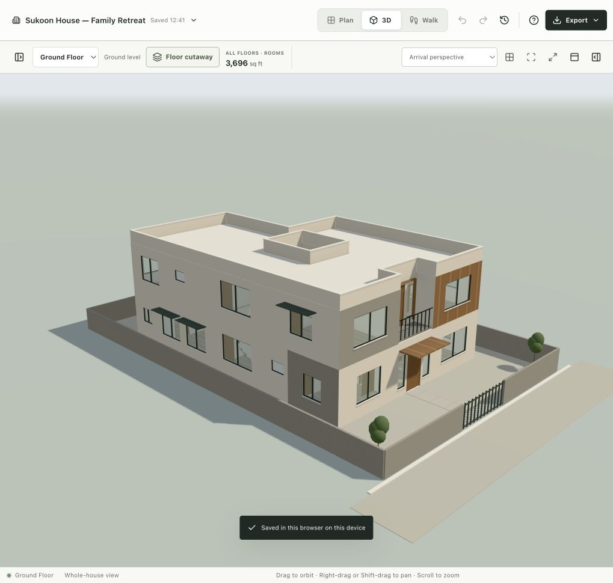
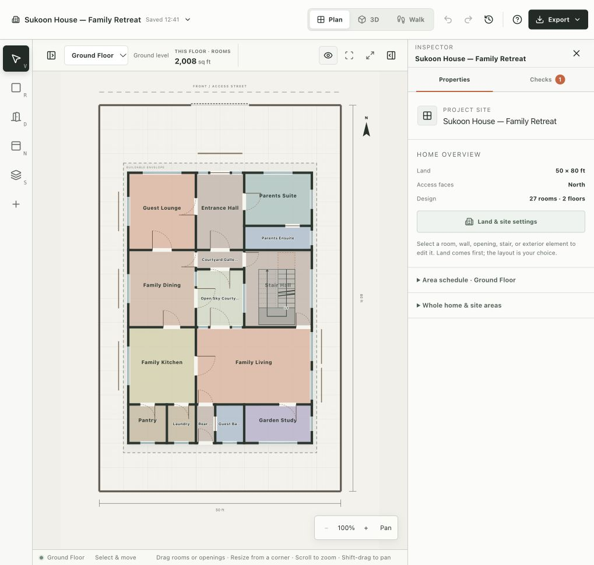
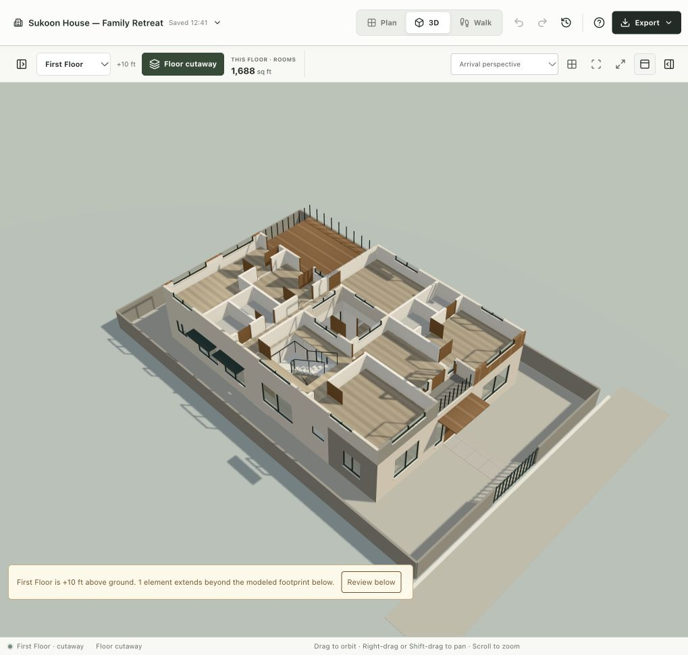

# Sukoon House — a complete ArchMorph build and studio audit

Built and inspected on 10 October 2026 in the local studio at `http://localhost:3000/studio`.

The deliverable is **Sukoon House — Family Retreat**, a two-storey, four-bedroom courtyard house. It was built through the studio's shared editing tools, then explored in plan, exterior 3D, floor cutaways, and first-person Walk Mode. Every one of the 61 studio tool definitions was exercised at least once. This is broad end-to-end coverage, not exhaustive testing of every parameter combination or proof that every defect has been found.

The original house is preserved as project `project-e1983050`, design version **157**. Disruptive tests used a separate **Sukoon House — Tool Audit Copy**. Existing projects were preserved. Application implementation files were not changed for this audit.

## Open the house

The completed house is left open in the studio at its arrival perspective. On this browser/device it is available in **Project files → Sukoon House — Family Retreat**. The named checkpoint **Sukoon House · completed design v157** survived reloading.

For a portable copy, use **Project files → Import** and choose [sukoon-family-retreat.archmorph.json](../fixtures/sukoon-family-retreat.archmorph.json). The export contains the actual editable project, not a rendered concept image.

## Design intent

“Sukoon” means calm. The concept gives an extended family a private inner outdoor room, a ground-floor parents' suite, separate guest reception, several places to gather or retreat, and an upper garden terrace. A restrained mineral-stucco exterior is broken up by timber, concrete, a recessed balcony, an entrance canopy, and window shades.

The plot is assumed to be **50 × 80 ft**, with its front/access edge facing north. Assumed planning setbacks are front 12 ft, rear 8 ft, and 5 ft on both sides. These are project assumptions, not verified local planning requirements. Ground-floor rooms occupy a rectangle approximately 38 × 56 ft around a 10 × 12 ft open courtyard. The upper floor keeps the courtyard open and steps back to create a 280 sq ft garden terrace and a 40 sq ft arrival balcony.

Arrival leads into a 10-ft-wide hall. Guests can enter the front lounge without crossing private bedrooms. The parents' bedroom and ensuite are on the ground floor. The inner gallery distributes movement toward dining, the courtyard, and stairs. The kitchen, family living room, pantry, laundry, garden study, and guest bathroom occupy the rear half. Upstairs, three bedrooms are served by bathrooms, storage, a morning lounge, a library, and an evening lounge. The U-shaped stair has a 3.5-ft clear flight width and a half landing.

The design is a complete architectural **concept model**. Furniture, kitchen and bathroom fittings, structural assemblies, drainage, services, construction details, and a local code review are still needed before judging buildability or everyday clearances. Four bedroom windows have 2.5 × 3.5 ft clear-opening **design targets** entered in the model; these are not verified dimensions from selected window products. No parking provision is claimed.

## What was built

| Element | Final model |
| --- | ---: |
| Storeys | 2 |
| Named spaces | 27: 15 ground, 12 upper |
| Bedrooms / bathrooms | 4 / 4 |
| Canonical physical walls | 84 |
| Doors / windows | 34 / 39 |
| Stair | 1 U-shaped stair, two flights and one landing |
| Courtyard | 120 sq ft |
| Garden roof terrace | 280 sq ft |
| Recessed arrival balcony | 40 sq ft |
| Hosted façade features | 9: canopy, frame, seven shades |
| Exterior systems | Flat roof/parapet, site wall and slatted gate |

| Area definition | Ground | Upper | Building/site |
| --- | ---: | ---: | ---: |
| Indoor room area, wall centrelines | 2,008 | 1,688 | 3,696 sq ft |
| Gross covered area | 2,066 | 1,748 | 3,814 sq ft |
| Estimated carpet area | 1,850.5 | 1,548 | 3,398.5 sq ft |
| Open site outside gross ground footprint | — | — | 1,934 sq ft |
| Gross ground coverage | — | — | 51.7% |
| Floor area ratio | — | — | 0.954 |

The studio's centreline room area excludes courtyards; the outdoor slabs are reported separately. Estimated carpet area does **not** deduct finishes, stair voids, or independent partitions. These labels and distinctions are useful, but the number is not a finished-floor survey.

### Ground-floor schedule

| Space | Bounding dimensions | Centreline area |
| --- | --- | ---: |
| Guest Lounge | 14 × 16 ft | 224 |
| Entrance Hall | 10 × 16 ft | 160 |
| Parents Suite | 14 × 11 ft | 154 |
| Parents Ensuite | 14 × 5 ft | 70 |
| Courtyard Gallery | 10 × 4 ft | 40 |
| Family Dining | 14 × 16 ft | 224 |
| Stair Hall | 14 × 16 ft | 224 |
| Open Sky Courtyard | 10 × 12 ft | 120, outdoor |
| Family Kitchen | 14 × 16 ft | 224 |
| Family Living | 24 × 16 ft | 384 |
| Pantry | 8 × 8 ft | 64 |
| Laundry | 6 × 8 ft | 48 |
| Rear Hall | 4 × 8 ft | 32 |
| Guest Bathroom | 6 × 8 ft | 48 |
| Garden Study | 14 × 8 ft | 112 |

### Upper-floor schedule

| Space | Bounding dimensions | Centreline area |
| --- | --- | ---: |
| Primary Bedroom | 14 × 14 ft | 196 |
| Primary Ensuite | 7 × 6 ft | 42 |
| Dressing Room | 7 × 6 ft | 42 |
| Morning Lounge | 10 × 16 ft | 160 |
| Bedroom East | 14 × 16 ft | 224 |
| Upper Stair Hall | 14 × 16 ft | 224 |
| Bedroom West | 14 × 16 ft | 224 |
| Upper Gallery | 24 × 4 ft | 96 |
| Family Library | 12 × 12 ft | 144 |
| Linen Store | 6 × 8 ft | 48 |
| Family Bathroom | 6 × 8 ft | 48 |
| Evening Family Lounge | Custom orthogonal footprint | 240 |

## Verification and coverage

The final validator returned **zero errors and one warning**. Circulation reached **all 27 rooms**, with no disconnected rooms, invalid doors, or invalid stairs. The warning is the stairwell false positive described below. The validator's passing result only applies to its implemented checks.

The exported JSON was independently parsed, migrated through the application's import model, and checked for the expected version/counts, missing room-wall references, missing opening hosts, and circulation. These checks passed. Both SVGs parse as XML and identify the correct project, floor, and version 157 in their metadata. See [fixture verification](verification/sukoon-house/fixture-verification.json) and [final design summary](verification/sukoon-house/final-design-summary.json).

Tool coverage included project/plot setup, rooms and custom polygons, moving/resizing/shared boundaries, independent walls, splitting rooms and forming rooms from walls, all opening editing/rehosting/deletion tools, floors and floor heights, stairs, balconies, façade systems/materials, all inspection/calculation tools, validation, cameras, floor/view/navigation switching, focusing, snapshots, and exports. Destructive model edits were confined to the audit copy and were recoverable through Undo. See the [61-tool coverage record](verification/sukoon-house/tool-coverage.json).

Manual UI checks included project creation/duplication, local saving, checkpoints, reload recovery, floor switching, plan navigation, cutaways, camera selection, inspector/library access, Undo/Redo, export preparation, and Walk controls. A continuous ascent of the U stair successfully moved the camera from ground-floor eye height 5.4 ft to upper-floor eye height 15.4 ft and switched the active floor. The descent route was not separately tested.

At a 390 × 844 viewport on the audit copy, the plan had no document-level horizontal overflow. The inspector worked as an overlay and could be dismissed; Walk displayed its minimap and directional controls. This was a browser viewport check, not a test on physical mobile hardware. Temporary viewport overrides were reset.

The final observed renderer reported 22 mesh batches, 28 draw calls, 62,404 triangles, 34 rendered door panels, and 39 rendered windows. One scene build took about 498 ms. These are one-machine observations, not performance benchmarks. The captured final browser error/warning log was empty. See [renderer metadata](verification/sukoon-house/renderer-metadata.json) and [console log](verification/sukoon-house/console-final.json).

## Reproduced bugs and integration failures

Follow-up implementation and current status: [Studio audit fixes, 11 October 2026](STUDIO_AUDIT_FIXES_2026-10-11.md). The findings below preserve the original audit observations.

P1 = affects design trust or an essential workflow. P2 = consistency, usability, or accessibility. Severity is this audit's triage suggestion.

| ID | Priority | Finding and reproduction | Improvement / acceptance check |
| --- | --- | --- | --- |
| B01 | P1 | **False unsupported-base warning for a stairwell.** The upper stair hall is directly aligned over the ground hall, but validation reports 86.25 sq ft unsupported. This is exactly the U-stair void: 7.5 × 11.5 ft. `upperFloorBaseFindings` subtracts stair holes from the lower footprint while comparing against the complete upper room polygon. | Compare actual occupied upper slab area, excluding the intended stair opening. A aligned two-floor stair hall should not acquire this warning solely because its stair is modeled. Keep real overhang warnings. |
| B02 | P1 | **Terrace/railing is not a Walk boundary.** From the Family Library, movement west reached the terrace and then continued through its west railing to x≈3.92 ft, outside the slab starting at x=6 ft. Eye height remained 15.4 ft. [Evidence](verification/sukoon-house/walk-terrace-edge.jpg). | Add railing collision and supported-floor domains. Walking must stop at a modeled guard, and must not float over an unsupported edge. |
| B03 | P1 | **Overlapping outdoor slabs accepted and counted twice.** Add a second upper terrace at x=6,y=50,width=14,length=20, exactly over Garden Roof Terrace. The tool succeeds; validation still reports zero errors/only B01. `projectTerraceArea` rises from 280 to 560 sq ft. | Reject unintended same-floor overlap with rooms/slabs or explicitly represent allowed overlaps and union their area. Exact duplicates must not silently double usable outdoor area. |
| B04 | P1 | **Implausible entrance size passes validation.** `update_opening` accepted width=0.5,height=0.5 ft on the main entry. Validation reported zero errors/only B01 and circulation still counted the entry. Door-specific tools have minimum width=2,height=6 ft, whereas the general tool and inspector allow 0.5. | Use one canonical door constraint policy across UI and all tools. Separate geometric validity from passage clearance; a six-inch main entrance must be flagged and must not imply a usable route. |
| B05 | P1 | **Resize responses return stale wall IDs.** Create a 6 × 6 ft room at (52,34), resize width to 8 ft, then inspect it. The mutation response returns walls ending at x=58; inspection returns the rebuilt walls ending at x=60. The live geometry is correct, but an agent chaining the returned IDs can fail. Morning Lounge and shared-boundary results showed the same stale-reference pattern. | Build responses from the post-topology canonical model. Every returned wall ID must resolve immediately in the same project version. Audit move, resize, polygon, and shared-boundary responses together. |
| B06 | P1 integration | **Native tool handles remained stale after reload.** The UI restored the saved house and displayed 61 registered tools, but native inspection failed with stale-registration errors even after repeated `fetchTools()`, rebinding, and a fresh tab. The built-in console continued to work. A later browser-control session reset recovered native calls without changing application code. | Investigate registration lifecycle and client discovery caching together. Test hydration, reload, project switching, and re-registration. Attribution to app versus browser bridge remains unconfirmed; this is not proof of model corruption. |
| B07 | P2 | **Floor inspection changes the meaning of `stairs`.** Upper-floor summary includes the connecting stair with role `upper-entry`; full inspection returns `stairs:[]`. The connecting stair still exists in `stairDetails`, so the geometry is not missing from the entire response. | Make ownership and floor-visible/connecting stairs explicit and consistent. Full inspection should preserve the summary IDs in an equivalent collection. [Summary](verification/sukoon-house/upper-summary-v157.json), [full](verification/sukoon-house/upper-full-v157.json). |
| B08 | P2 | **Door swing language lacks a room reference.** “Inward,” “outward,” handing, and hinge side require trial-and-error to make a door swing into a desired room. Plan and 3D calculate swing from wall orientation and the two sign settings, without an “opens into room” reference. Several leaves initially occupied the narrow gallery or outdoor balcony. | Add “opens into [adjacent room]” and preview the sweep. Define handing/hinge/swing semantics once. Detect sweep clashes with walls, nearby doors, fixtures, and required passage zones. |
| B09 | P2 | **A 3D toolbar button loses its accessible name.** At the normal approximately 1019-px view, “Edit in plan” becomes an unnamed icon button because responsive CSS hides its text and the button has no independent aria label. | Supply a persistent accessible name and tooltip at every breakpoint; test icon-only toolbar controls. |
| B10 | P2 | **Rename/export filename promise is inaccurate.** After renaming the copy, JSON was still named `archmorph-project-v35.json`; the rename tool description promises the new project name in subsequent filenames. Ground and upper SVG exports also share `archmorph-plan-v157.svg`. | Include a sanitized project name and floor name/ID where relevant; keep version metadata. Prevent ordinary multi-floor exports from colliding. |
| B11 | P2 | **Developer console clips evidence.** Every output is truncated after 1,600 characters, often mid-JSON; there is no full-output control. Only 30 recent tool calls remain. A complete project build quickly loses its early inspection evidence. | Provide expandable/full JSON, copy/download, filter/search, and a portable audit log. Keep a readable compact default. |

Exact native reproductions of B03–B05 are saved in [audit-native-followups.json](verification/sukoon-house/audit-native-followups.json). The recent console results, including successful edits and deliberate rejected inputs, are in [audit-console-calls.json](verification/sukoon-house/audit-console-calls.json). The audit-copy JSON is retained only for reproduction and should not be confused with the completed house.

## Observed workflow limitations

| ID | Limitation | Improvement |
| --- | --- | --- |
| L01 | Walk renders all recorded doors open, including doors stored as closed. This is deliberate in `ModelView`, but makes the walkthrough differ from plan/orbit and prevents testing closed-door behavior. | Interactive opening/closing, with a visible navigation policy and consistent state. |
| L02 | On a terrace, the current position reads “Outside rooms”; the minimap omits terrace/balcony slabs. The circulation graph has room/site nodes rather than outdoor-space destinations. | Treat accessible outdoor spaces as named destinations with door connections and floor-aware navigation. |
| L03 | Changing a camera preset retains an existing element focus. After adding the last window, a standard view was still cropped to that element until `focus_element({})`. | Make camera scope explicit; offer project/floor/selection view commands. |
| L04 | Enabling cutaway forces `front-right` and whole-project focus, losing the chosen rear/opposite camera. | Preserve orientation, or offer a separate “recommended cutaway view” action. |
| L05 | A room split inherits the original room type. The new Parents Ensuite initially remained a Bedroom and needed a separate type edit. | Accept explicit types/names for both resulting spaces in one operation. |
| L06 | Whole-plot plan labels truncate the courtyard gallery, rear hall, and small bathrooms. The SVG still contains interactive-canvas guidance rather than a presentation-oriented drawing description. | Responsive labels, leaders/tooltips, room-number legend, and a clean publication export mode. |
| L07 | Undo/Redo history disappeared on reload; named checkpoints survived. Checkpoints are capped at eight and activity at 100 entries. | Make session history versus durable versions clear; add persistent versions and named design alternatives. |
| L08 | Saving and project libraries are local to a browser/device. A second tab can work on a different active project; the final primary tab needed an explicit save after audit-copy work. | Clear active-project and cross-tab state, reliable conflict resolution, portable sharing and collaboration. |
| L09 | Export download preparation succeeded, but the automation's event-based Save-file capture timed out. Direct native JSON/SVG content and native PNG capture succeeded. | Verify download handling in supported browsers separately. This timeout is not evidence that a human download is broken. |
| L10 | The family home required roughly 157 design revisions and many individual opening/finish calls. There is no exposed atomic batch tool for a fully checked set of architectural edits. | Preview a group of changes, validate dependencies, apply/undo as one design intent, and return a compact diff. |

## Product and architectural capability limits

These are limits observed in the current tool catalog, interface, model, or source—not all are bugs.

- Geometry is primarily orthogonal rooms with 4–12 polygon vertices, rectangular plot/slabs, and quarter-turn stairs. Independent walls can be angled, but wall-to-room conversion requires an orthogonal enclosure. Angled room footprints and plot boundaries, curves, custom balcony outlines, and more varied stairs need broader geometry support.
- Roof tools cover a flat roof and parapet. Pitched/curved roofs, roof access, drainage slopes, gutters, waterproofing, and detailed terraces are not modeled by these tools.
- Doors are one hinged-leaf model. Sliding, pocket, double-leaf, folding, glazed patio doors, archways, and genuinely open internal connections are missing. A large single swinging leaf is a poor stand-in for a broad living/courtyard opening.
- There is no furniture/fixture layout surface in the 61-tool catalog. Beds, wardrobes, seating, toilets, showers, counters, appliance doors, work triangles, and practical clearance checks are needed to assess comfort. A room area or graph connection alone cannot do this.
- The upper-base check is footprint guidance, not structural analysis. Columns, beams, load paths, spans, slab design, foundations, soil, and earthquake/wind design are not established by the model.
- Plumbing, drainage, electrical, HVAC, shafts, service access, acoustics, fire separation, and construction assemblies are not developed. The concept's bathroom stacking and wet-wall strategy still need design work.
- Stair rise/run and connectivity are useful, but this session did not establish a complete headroom, handrail, guard, accessibility, evacuation, or local code review. Connected rooms are not a measured escape route. Narrow doorways and door sweeps need independent checks.
- Glazing fields and clear-opening inputs depend on trustworthy product data. Defaults or design targets cannot certify daylight, ventilation, thermal performance, or emergency escape suitability.
- The rendered sun is a fixed directional light. Attractive shadows do not demonstrate a location/date-based solar, daylight, heat-gain, or seasonal shading study.
- The plot assumptions lack a survey, terrain, street levels, surrounding buildings, utility connections, and verified regulations. There is no modeled vehicle turning or parking assessment in this house.
- Units are feet/square feet in the present project model. Metric display/input, feet-and-inches entry, consistent rounding, and annotated dimensional chains would improve international and practical usability.
- Deliverables are JSON, active-floor SVG, and view PNG. An architect handoff needs coordinated sheets, title blocks, room/opening schedules, dimension chains, elevations, sections, and appropriate CAD/BIM exchange.
- Materials are lightweight visual finishes. Physical assemblies, realistic internal finishes, textures at construction scale, specification quantities, cost ranges, and material alternatives are not established.

## What worked well

The shared canonical model held up through a substantial build. Adjacent rooms shared walls; doors/windows produced real 3D cutouts; courtyard and stair openings appeared in the building; different floors, exterior slabs, and façade hosts stayed coherent. Resizing Morning Lounge remapped its doors and timber frame to the new façade position in the live model, despite the stale mutation-response IDs.

Independent-wall editing is useful: a four-wall enclosure at (52,20)–(62,30) became an Office while preserving all four wall IDs, a 0.55-ft wall thickness, brick finish, and valid rehosted openings. Duplicate reversed-endpoint walls were rejected. Overlapping rooms were rejected with an explicit overlapping area. A polygon edit that stranded a window was rejected atomically; it succeeded after the obstructing window was removed. Deleting a room-boundary wall directly was correctly rejected.

Undo/Redo worked across agent-originated design edits. After stair deletion, undo/redo/undo restored the stair, and subsequent native inspection confirmed one staircase in the copy. Autosave, a distinct audit project, checkpoints, and portable exports provided useful recovery paths. Walk Mode traversed both U-stair flights and the landing successfully. The area definitions and explicit uncertainty language around structural support and window clear openings are strong foundations.

## Recommended work order

1. **Trust and recovery:** B01–B07, canonical opening limits, outdoor overlap accounting, native registration recovery, and responses drawn from committed topology. Add regression cases using this house and isolated reproductions.
2. **Spatial judgment:** correct door semantics, sweep/clearance checks, furniture and fixtures, terrace destinations/guards, and accurate usable floor area around stair openings.
3. **Iteration:** atomic multi-edit previews, design alternatives, persistent version comparisons, reliable project sharing, and full tool-call evidence.
4. **Architect handoff:** coordinated dimensioned plans, elevations/sections, schedules, clean filenames, presentation exports, and clear data confidence.
5. **Broader architecture:** irregular sites and terrain, additional roof/door/slab/stair types, services, climate-aware studies, and cost/specification workflows.

## Evidence gallery and files

- Editable model: [Sukoon House JSON](../fixtures/sukoon-family-retreat.archmorph.json)
- Vector drawings: [ground plan](verification/sukoon-house/ground-floor.svg), [upper plan](verification/sukoon-house/first-floor.svg)
- Exterior: [arrival](verification/sukoon-house/arrival-final.jpg), [rear](verification/sukoon-house/rear-final.jpg), [native canvas PNG](verification/sukoon-house/arrival-native.png)
- Cutaways: [ground](verification/sukoon-house/ground-cutaway-final.jpg), [upper](verification/sukoon-house/upper-cutaway-final.jpg)
- Inside: [family living](verification/sukoon-house/walk-family-living-final.jpg), [courtyard](verification/sukoon-house/walk-courtyard-final.jpg), [stair flight](verification/sukoon-house/walk-stair-flight.jpg), [upper arrival](verification/sukoon-house/walk-upper-arrival.jpg), [terrace](verification/sukoon-house/walk-terrace.jpg)
- Responsive check: [phone plan](verification/sukoon-house/mobile-plan.jpg), [phone walk](verification/sukoon-house/mobile-walk.jpg)
- Structured results: [tool catalog](verification/sukoon-house/tool-catalog.json), [coverage](verification/sukoon-house/tool-coverage.json), [final native calls](verification/sukoon-house/final-native-calls.json), [audit reproductions](verification/sukoon-house/audit-native-followups.json), [fixture verification](verification/sukoon-house/fixture-verification.json)

Final-named views and both SVGs show version 157. Earlier stair/terrace walkthrough screenshots show the pre-audit version 132 with the same stair and outdoor slab geometry. Phone images show the separately named audit copy. The console evidence contains only its last 30 calls and clipped outputs; it is not a complete historical transcript.
